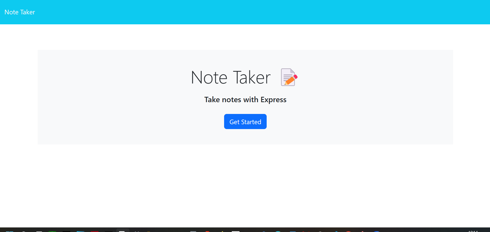
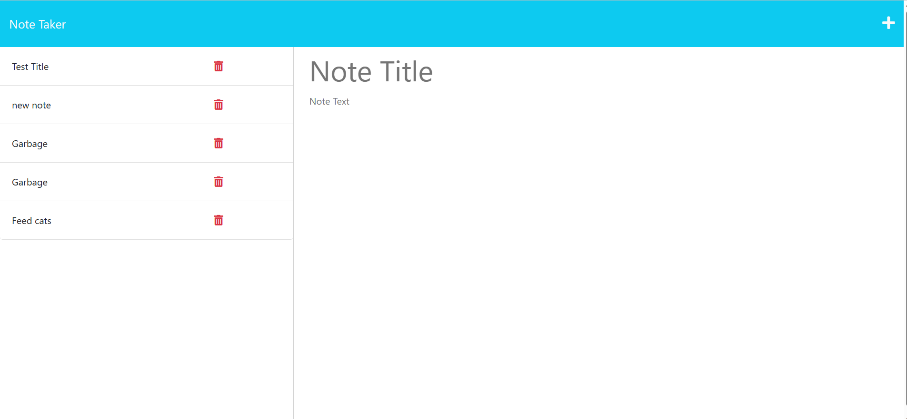
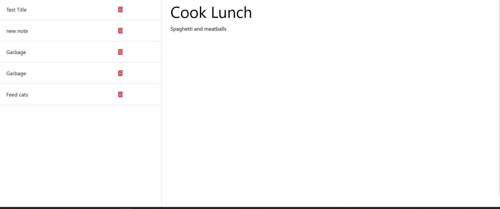
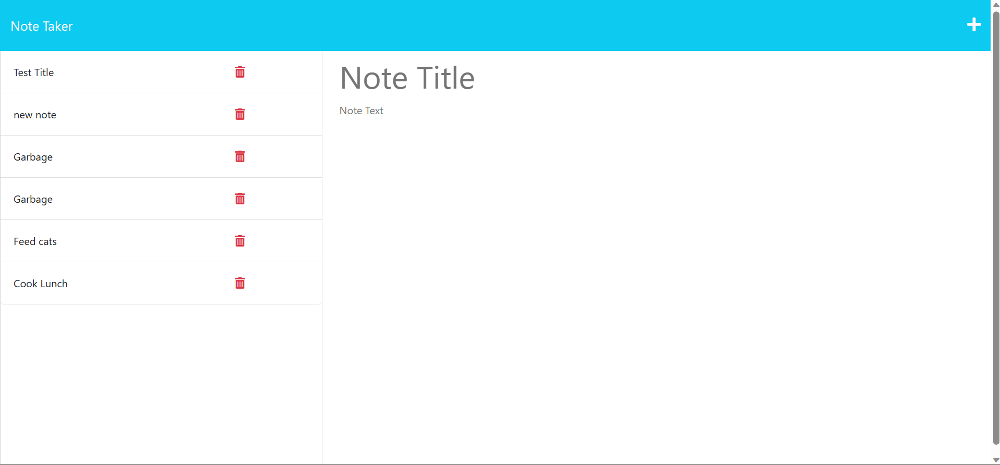

# myNoteTaker

## Description
The user gets to a front page, and clicks on the button that states "Get started".  This takes the user to the notes.html page, where the user has the option of adding a note, as well as being able to click on a note and view it.

This is the front page:

[]

Clicking on the 'Get started button' will take you here.

[]

The user can enter a note:

[]

The user can save the note:

[]

### Skills used
This program was designed using express.js, node.js, nodemon, and javascript.
